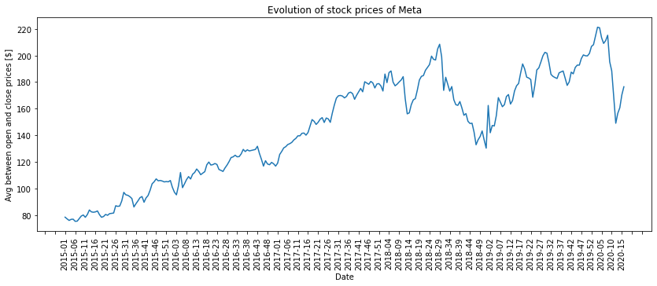

---
# Skeleton
# Abstract & introduction (Feez)
<!-- An introduction about project and why it could be useful.
Describe where the data comes from 
One or two sentences on how to extract the data-->

In February 2004, at Harvard University, a student created a website allowing other students to discuss, exchange ideas, publish their best jokes. 
This small project quickly spread to the campus, then to other universities, and finally to the whole world. This is how Mark Zuckerberg became a billionaire in a few years.
However, like any famous person, he is often exposed to a lot of criticism, especially in recent years. It is important that each person can express himself freely by giving his opinion on the decisions and actions of multinationals. 
By relaying these opinions in the media, it not only allows the company to get honest and constructive feedback, but also transmits the information to the customers or users, who might suffer the consequences.
But do these reviews have a real impact on the financial health of the company? 

In this article, we will analyze quotes from 2015 to 2020 from the Quotebank dataset to determine positive and negative thoughts about Mark Zuckerberg and his companies.
Next, we will profile the types of people issuing these quotes and analyze their tendencies to speak kindly or unfavorably about Mark Zuckerberg.
Finally, we will determine if the impact of these positive and negative reviews is significant on Facebook's stock numbers over time.

# Sentiment analysis
## Global result (Neygo)
Explain global result about sentiment analysis on the quotes concerning Mark Zuckerberg.
present the two main plots and say that we cannot say anyhting.
-> Cambridge analytica

## Clustering (Alessio)
Decompose the analysis into smaller groups.
### Investigate clusters (Neygo)
Result of the custom K medioids algorithm and small investigation of the clusters.

## Regression analysis (Cyrille and Alessio)

How do the opinions of different groups of people in the news about Mark Zuckerberg and his companies relate to the
the success his success ? To investigate this question, we use different regression analyses. This
allows us to discover if there are certain trends for a given group, whether these trends are statistically
significant and how they impact his success. We see below how we can quantify the success of Mark Zuckerberg.

### How can we measure the success of an entrepreneur ?

There are different possible ways to quantify the success of an entrepreneur. If we remain down to
earth and do not enter philosophical discussions on what actually is success, we can imagine evaluating
our person of interest, Mark Zuckerberg, by looking at his wealth over time. However, this is not always
easy to do as is since we do not have transparent access to his assets, properties and their values.

Instead, we use a "proxy" for his wealth by considering the stock price on the Nasdaq Market for a
company is well known for, Facebook, now Meta Platforms Inc. Mark Zuckerberg is the CEO and one of the founders of Meta Platforms
that regroups entities such as Facebook, Instagram, Whatsapp. As the stock market is generally reactive
to, for examples, scandals, new improvements on products etc, it is a reasonable way to quantify how
well Mark Zuckerberg is doing. Moreover, this is a reliable source of information for the period we are
treating (2015-2020) as we can easily access daily stock prices for the past years.

As said [above](#sentiment), we consider weekly data. For the stock price, the daily opening and closing
prices are averaged and then these values are averaged over each week to get a single representative 
price for the week. In the figure below, we have the evolution from 2015 to 2020 of this weekly average
stock price. It increases steadily from 2015 until the beginning of 2018. Around March 2018, it falls.
This corresponds to the period where the Cambridge Analytica scandal with Facebook exploded. So this verifies
that the stock market is reactive to external events as we said above.

More concretely, the design matrix is built as follows. A datapoint (predictor) is the vector of average positive and negative
scores over a given week as well as the number of quotes made during that week, and this for every group. What 
we would like to investigate is whether trends in the opinions of some groups give some indications about the
futur behavior of the stock price of Meta. Therefore, for a predictor at week n, we consider the stock
price at week n+1 as its response variable.

### Regression analysis on specific attributes

Explain how we did regression analysis and present the results when splitting on different attribute values.

### regression analysis on the clustering
Show and comment the regression analysis result on the group extracted via clustering.
un espace

# Conclusion (Feez)
Answer to the question
Limitations
---
# Introduction
## Abstract
With the world getting more and more connected, in particular the domain of news and journalism,
we get access to opinions of huge amount of people. These opinions can express negative, positive or
simply neutral sentiments about a subject or person. Public personalities like Mark Zuckerberg are
particularly exposed to criticism, being positive or negative. But do these online opinions really affect
his success ? Opinions of specific groups of people may indicate a rise or a fall
in his career.

In this article, we will identify the polarity of opinions in the news and try to identify different types
of authors. The study of the polarity of the opinions of each of these groups will then allow us to
potentially identify specific types of people that are a good indicators of the success of Mark Zuckerberg. 

## Data
We use a subset of the [QuoteBank dataset](https://dlab.epfl.ch/people/west/pub/Vaucher-Spitz-Catasta-West_WSDM-21.pdf)
which contains quotes made in English-speaking news articles published between 2015 and 2020. To measure the success
of Mark Zuckerberg, we use the stock price of his company Meta on the [Nasdaq Stock Market](https://www.nasdaq.com/market-activity/stocks/fb/historical).

