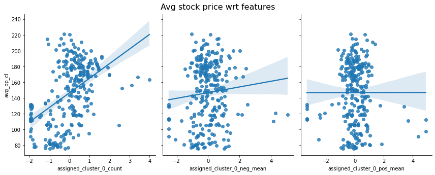

Do we put an image on the whole width behind the title ?
---
# Skeleton
# Abstract & introduction (Feez)
<!-- An introduction about project and why it could be useful.
Describe where the data comes from 
One or two sentences on how to extract the data-->

In February 2004, at Harvard University, a student created a website allowing other students to discuss, exchange ideas, publish their best jokes. 
This small project quickly spread to the campus, then to other universities, and finally to the whole world. This is how Mark Zuckerberg became a billionaire in a few years.
However, like any famous person, he is often exposed to a lot of criticism, especially in recent years. It is important that each person can express himself freely by giving his opinion on the decisions and actions of multinationals. 
By relaying these opinions in the media, it not only allows the company to get honest and constructive feedback, but also transmits the information to the customers or users, who might suffer the consequences.
But do these reviews have a real impact on the financial health of the company? 

In this article, we will analyze quotes from 2015 to 2020 from the Quotebank dataset to determine positive and negative thoughts about Mark Zuckerberg and his companies.
Next, we will profile the types of people issuing these quotes and analyze their tendencies to speak kindly or unfavorably about Mark Zuckerberg.
Finally, for each of theses people catergories, we will determine if the impact of these positive and negative reviews is significant on Facebook's stock numbers over time.

# Sentiment analysis
## Global result (Neygo)
Explain global result about sentiment analysis on the quotes concerning Mark Zuckerberg.
present the two main plots and say that we cannot say anyhting.
-> Cambridge analytica

## Clustering (Alessio)
Decompose the analysis into smaller groups.
### Investigate clusters (Neygo)
Result of the custom K medioids algorithm and small investigation of the clusters.

## Regression analysis (Cyrille and Alessio)

How do the opinions of different groups of people in the news about Mark Zuckerberg and his companies relate to the
the success his success ? To investigate this question, we use different regression analyses. This
allows us to discover if there are certain trends for a given group, whether these trends are statistically
significant and how they impact his success. We see below how we can quantify the success of Mark Zuckerberg.

### How can we measure the success of an entrepreneur ?

There are different possible ways to quantify the success of an entrepreneur. If we remain down to
earth and do not enter philosophical discussions on what actually is success, we can imagine evaluating
our person of interest, Mark Zuckerberg, by looking at his wealth over time. However, this is not always
easy to do as is since we do not have transparent access to his assets, properties and their values.

Instead, we use a "proxy" for his wealth by considering the stock price on the Nasdaq Market for a
company is well known for, Facebook, now Meta Platforms Inc. Mark Zuckerberg is the CEO and one of the founders of Meta Platforms
that regroups entities such as Facebook, Instagram, Whatsapp. As the stock market is generally reactive
to, for examples, scandals, new improvements on products etc, it is a reasonable way to quantify how
well Mark Zuckerberg is doing. Moreover, this is a reliable source of information for the period we are
treating (2015-2020) as we can easily access daily stock prices for the past years.

As said [above](#sentiment), we consider weekly data. For the stock price, the daily opening and closing
prices are averaged and then these values are averaged over each week to get a single representative 
price for the week. In the figure below, we have the evolution from 2015 to 2020 of this weekly average
stock price. It increases steadily from 2015 until the beginning of 2018. Around March 2018, it falls.
This corresponds to the period where the Cambridge Analytica scandal with Facebook exploded. So this verifies
that the stock market is reactive to external events as we said above.

More concretely, the design matrix is built as follows. A datapoint (predictor) is the vector of average positive and negative
scores over a given week as well as the number of quotes made during that week, and this for every group. What 
we would like to investigate is whether trends in the opinions of some groups give some indications about the
futur behavior of the stock price of Meta. Therefore, for a predictor at week n, we consider the stock
price at week n+1 as its response variable. Since the different features do not have the same range (positive score
is between 0 and 1 but the number of quotes may be in the hundreds), we standardize the features.

Note that here the goal is exactly to predict very accurately the stock price of the upcoming week based
on the current week quotes but rather to see if there trends among certain groups that emerges. To accurately
predict the stock prices, we would probably need more complex models as well as other features. However, more complex models
quickly becomes less interpretable (black-box models) and this would prevent us to extract the trends
we look for. So a simple linear regression is well suited for this task.

### Regression analysis on specific attributes

Let's look at different possible characterizations of people. Below, we consider the following one :
 - Gender (named according to WikiData)
 - The continent where the author comes from
 - Her/his age, distributed into 4 ranges : 0-25, 26-50, 51-75 and 75+
 - Using our custom [clustering](#clustering)

The data contained many different genders. Sadly, the genders other than women/men were under-represented.
This means many weeks were not containing any quotes by such authors and therefore would introduce missing
data in our design matrix. So for technical reasons, we focus only on these 2 genders.

#### Analysis by gender

How the different features for each group, here women and men, relate to the stock price. Below, we
have the relation between the stock price at week n+1 and the different features at week n, as well as
a regression line estimated from the given feature only. We directly observe that there is no very clear linear correlation
between a feature and the price. Some features as the positive mean for men even seem to be irrelevant whereas
other features such as the number of quotes made by women seem to exhibit a slight linear relationship.

To find more accurate insights about these possible trends, let's consider the coefficients obtained 
with a linear regression taking as input all the 6 features above and as output the (delayed) average stock price.
The statistically significant coefficients at level 5\% are shown in color, the others in gray. Over the 6 features,
only 3 are statistically significant at level 5\%. Surprisingly, the coefficient associated to the negative
sentiment for the men is positive. This means that the more negative the men quotes are the higher the stock prices
tend to be.

Women quotes are a good sign for the price whereas the number of men quotes is a bad omen for the stock price.
Indeed, the number of quotes made by men is negative whereas the one for women is positive.

<iframe frameborder="no" border="0" marginwidth="0" marginheight="0" width="100%" height="600" allowfullscreen="true" src="assets/img/coeffs_gender.html"></iframe> 

#### Where do they come from ?

Similarly to the analysis on genders, the only features that matters here are the number of quotes and the negative
score but the positive score is not relevant (not statistically significant at level 5\%). Again, there is
some contrast between the number of quotes in different groups. The more American quotes there is, the lower 
the price tend to be whereas the more quotes there are in Europe or Asia, the higher the price is likely to be.

<iframe frameborder="no" border="0" marginwidth="0" marginheight="0" width="100%" height="600" allowfullscreen="true" src="assets/img/coeffs_continent.html"></iframe>

#### How old are they ? 

Here we look at the different ranges of age in the authors. Namely we consider the ranges [0-25], [26-50], [51-75], [76+].

We don't change a winning team... it is again the count of quotes and the negative score that matter most. However,
the positive score for the 76+ authors seem to be relevant as well. But, as surprisingly as before, the corresponding
coefficient is negative, meaning that the more positive the quotes are for these people, the lower the stock price tends to be.

We can also look at the magnitude of the significant coefficient for the negative scores. A larger coefficient
would mean that this group is more "influential" or gives stronger indication that the stock price will be high (as they are all
positive). For example here, the most relevant group would be the 26-50, which tend to be the most active and powerful
in the industry in general, seem to weigh more in the behavior of the stock prices than the other 2 groups. This also
reflect the fact that we have a majority of people in this range of age in our dataset.

A contrast in the count of quotes also emerges. Young people seem to be more critical in their opinions than older people.
Indeed, the coefficient for the count of quotes by young people (0-25) is negative whereas the one for the older people
(76+) is positive. This is in concordance with our previous [analysis](#global-result-neygo).

<iframe frameborder="no" border="0" marginwidth="0" marginheight="0" width="100%" height="800" allowfullscreen="true" src="assets/img/coeffs_age.html"></iframe>

#### Who are they ?

<iframe frameborder="no" border="0" marginwidth="0" marginheight="0" width="100%" height="1000" allowfullscreen="true" src="assets/img/coeffs_cluster.html"></iframe>

# Conclusion (Feez)
Answer to the question
Limitations
---
# Introduction
## Abstract
With the world getting more and more connected, in particular the domain of news and journalism,
we get access to opinions of huge amount of people. These opinions can express negative, positive or
simply neutral sentiments about a subject or person. Public personalities like Mark Zuckerberg are
particularly exposed to criticism, being positive or negative. But do these online opinions really affect
his success ? Opinions of specific groups of people may indicate a rise or a fall
in his career.

In this article, we will identify the polarity of opinions in the news and try to identify different types
of authors. The study of the polarity of the opinions of each of these groups will then allow us to
potentially identify specific types of people that are a good indicators of the success of Mark Zuckerberg. 

## Data
We use a subset of the [QuoteBank dataset](https://dlab.epfl.ch/people/west/pub/Vaucher-Spitz-Catasta-West_WSDM-21.pdf)
which contains quotes made in English-speaking news articles published between 2015 and 2020. To measure the success
of Mark Zuckerberg, we use the stock price of his company Meta on the [Nasdaq Stock Market](https://www.nasdaq.com/market-activity/stocks/fb/historical).

